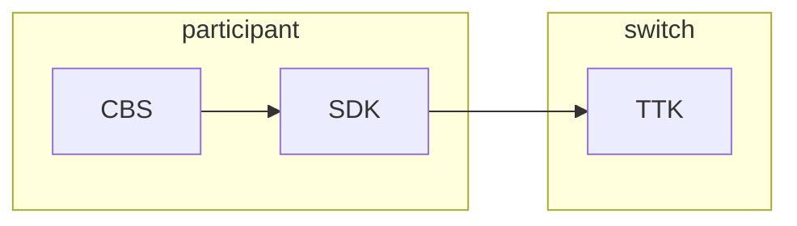

# SDK test

## Architecture

## SDK ports

- **Port 4000**: Inbound API (receives requests from Mojaloop)
- **Port 4001**: Outbound API (sends requests to Mojaloop) - **Use this for transfers**
- **Port 4002**: Test API

# References

- https://github.com/mojaloop/sdk-scheme-adapter
- https://github.com/mojaloop/api-snippets/blob/main/docs/sdk-scheme-adapter-outbound-v2_0_0-openapi3-snippets.yaml

